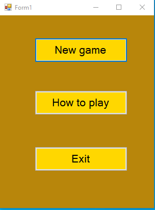
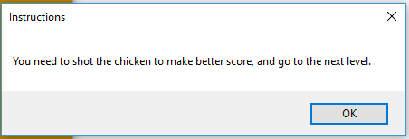
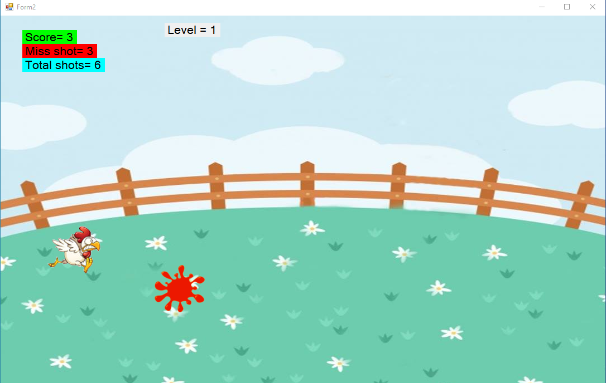

ChickenShoot			                                                                  

Опис на играта
Проектот ChickenShoot претставува игра. Играта се состои од гаѓање на мета (кокошка) и собирање на поени. 

На почетокот на играта се појавува форма во која може да одбереме дали сакаме  -нова игра
-да ги видиме правилата на игра 
-да ја исклучиме играта.

 

Доколку кликнеме на How to play во message box ни се појавуваат правилатта на играта.

И конечно со кликнување на New Game ни се отвара главната форма.
ChickenShoot се игра на тој начин што со лев клик се гаѓа кокошката која се движи во random правец.  Со секој погодок се добиваат поени . Играта има 4 нивоа и за да се премине од едно ниво во друго треба да се исполни одредена квота со поени. На секој левел има време од 1 минута кое мора да се запази во спротивно играта завршува. При одење на следен левел времето од 1 минута останува исто но движењето на кокошката се забрзува. 

Опис на решението

Главниот код за играта се состои во двете форми. Form1 и Form2. 
Главна метода за пресметување на поените е Shot методата.
void Shot()
        {
            pictureBox1.Visible = false;
            blood.Location = pictureBox1.Location;
            blood.Visible = true;
            pictureBox1.Visible = true;

            if (Score < 10)
            {    
                Score++;
                lblScore.Text = "Score = " + Score;
                lblLevel.Text = "Level = 1";
            }
            if (Score >= 10 && Score < 20)
            {
                
                if (Score == 10)
                {
                    timer1.Stop();
                    MessageBox.Show("You have reached Level 2. Chickens will move faster now, Get Ready! ");
                    timer1.Start();
                    progressBar1.Value = 60;
                }
                timer1.Interval = 1000;
                Score++;
                lblScore.Text = "Score = " + Score;
                lblLevel.Text = "Level = 2";
            }
            if (Score >= 20 && Score < 25)
            {
                if(Score == 20 )
                {
                    timer1.Stop();
                    MessageBox.Show("You have reached Level 3. Chickens will move faster now, Get Ready! ", "Level 3", MessageBoxButtons.OK);
                    timer1.Start();
                    progressBar1.Value = 60;
                }
                timer1.Interval = 750;
                Score++;
                lblScore.Text = "Score = " + Score;
                lblLevel.Text = "Level = 3";
            }

            if(Score >= 25 && Score < 30)
            {
                progressBar1.Value = 60;
                if( Score == 25 )
                {
                    timer1.Stop();
                    MessageBox.Show("You have reached Level 2. Chickens will move faster now, Get Ready! If you kill 1 chicken the time will be reseted. ", "Level 4", MessageBoxButtons.OK);
                    timer1.Start();
                }
                timer1.Interval = 500;
                Score++;
                lblScore.Text = "Score = " + Score;
                lblLevel.Text = "Level = 4";
            }

            if (Score >= 30 && Score < 33)
            {
                progressBar1.Value = 60;
                if (Score == 30)
                {
                    timer1.Stop();
                    MessageBox.Show("You have reached Level 2. Chickens will move faster now, Get Ready! If you kill 1 chicken the time will be reseted. You need to kill 3 more chicken to win the game", "Level 4", MessageBoxButtons.OK);
                    timer1.Start();
                }
                timer1.Interval = 250;
                Score++;
                lblScore.Text = "Score = " + Score;
                lblLevel.Text = "Level = 5";
            }
            if(Score == 33)
            {
                MessageBox.Show("Congratulations, You Won !");
            }

            Total_Shots++;
            lblTotalShot.Text = "Total shots = " + Total_Shots;
        }

Во оваа метода се менува сликата односно кога кокошката е погодена се става крв на тоа место. Се гледа нивото до каде сме стигнати и соодветно се менува брзината на кокошката во нејзиното движење.
Исто така тука се пресметуваат поените одностно тоа е променливата Score, и се дава известување дека преминуваме од едно ниво во друго.

made by Vlado Dimovski - 181182
